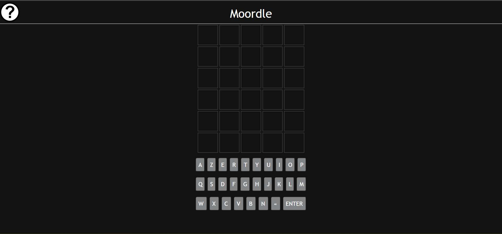
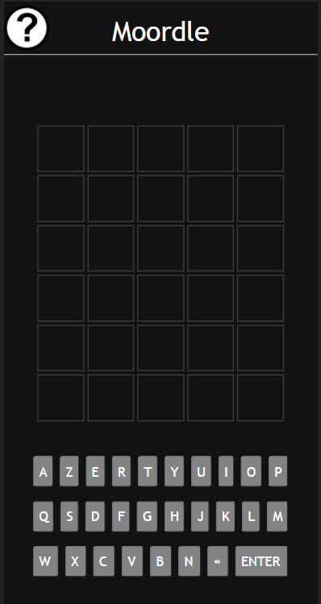

# Moordle (Woordle Clone in .NET)

## Description
Le but du jeu est de deviner un mot spécifique de cinq lettres en un maximum de six tentatives, en tapant des lettres sur un écran de six lignes de cinq cases chacune. La personne qui joue inscrit sur la première ligne un mot de cinq lettres de son choix et entre sa proposition. 
Après chaque proposition, les lettres apparaissent en couleurs : le fond gris représente les lettres qui ne se trouvent pas dans le mot recherché, le fond jaune représente les lettres qui se trouvent ailleurs dans le mot, et le fond vert représente les lettres qui se trouvent à la bonne place dans le mot à trouver.

Version web          |  Version mobile
:-------------------------:|:-------------------------:
  | 

## Licence
Javascript Code Remixed from https://github.com/kubowania/wordle-javascript for .NET CORE and translated in French
